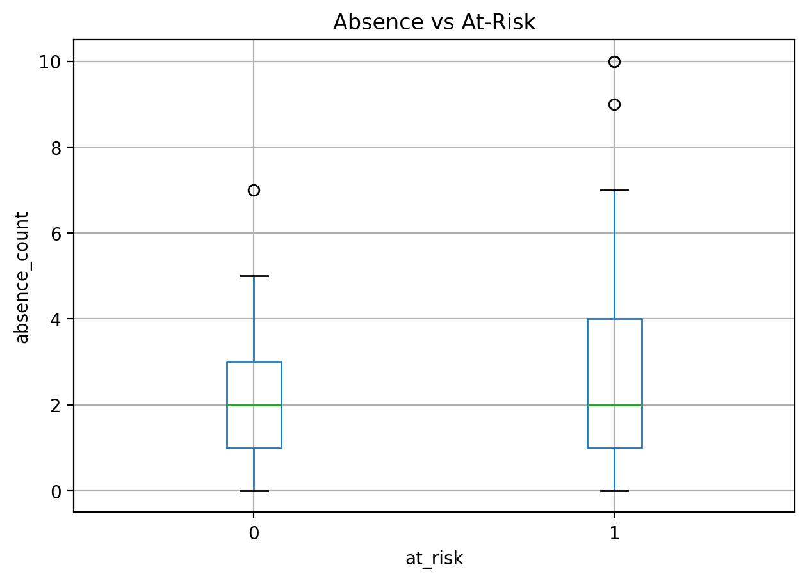
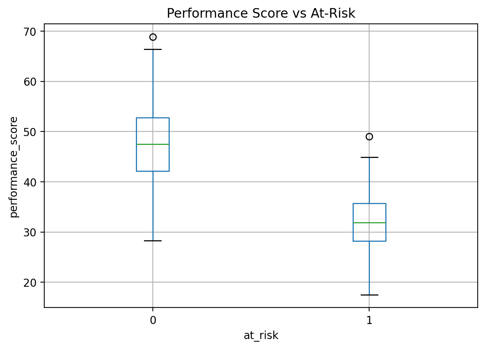
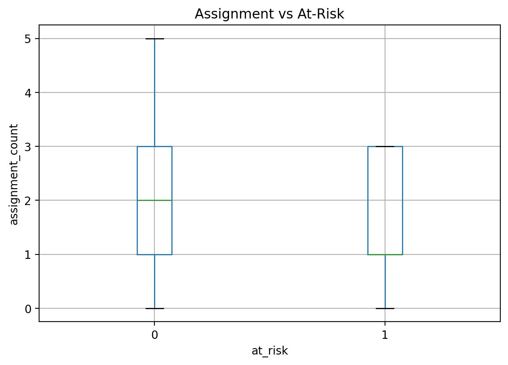
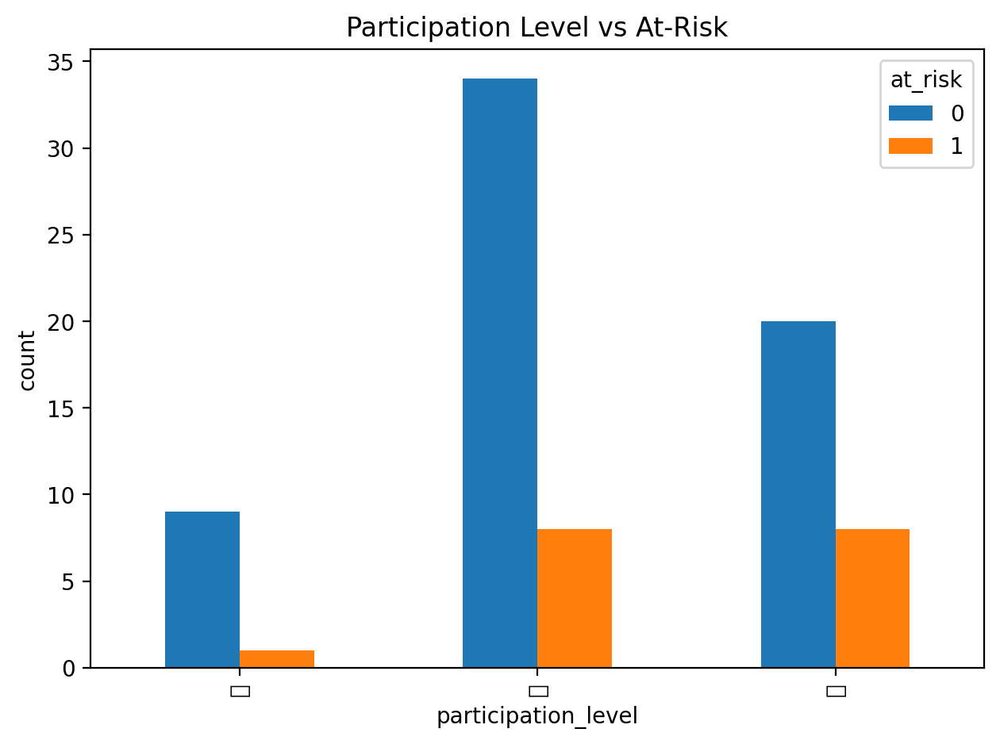
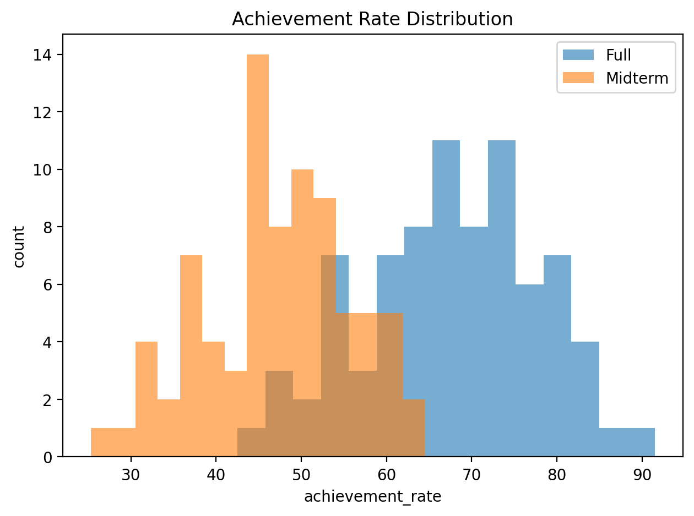
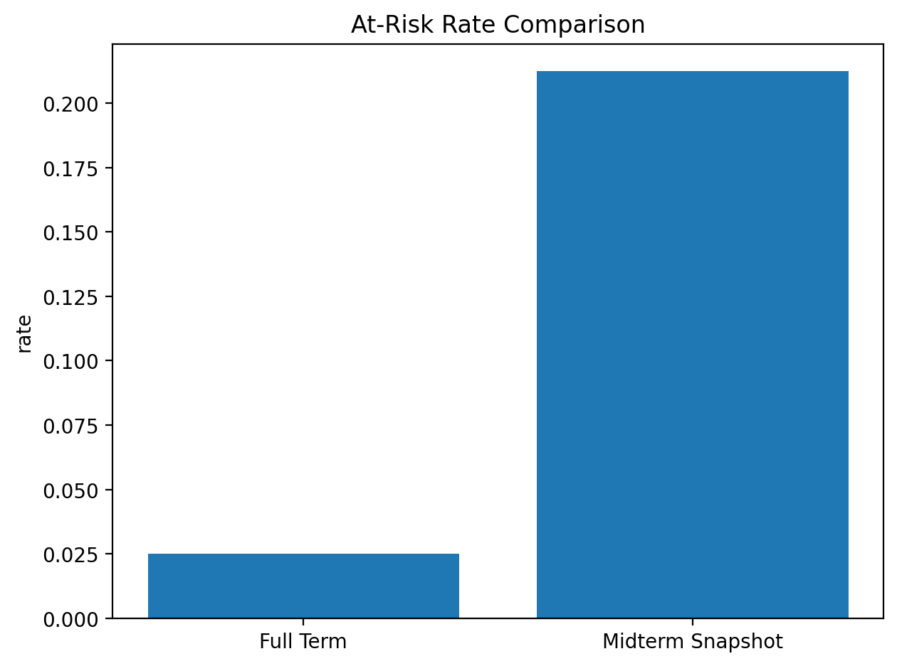

# 최성보 신호등 (MAP LIGHT) : EduTech Risk Prediction

학기 중간 시점의 학습/행동 데이터를 기반으로,  
최소성취수준 보장지도 대상(위험군)을 조기에 식별하고 교사 개입까지 제공하는 End-to-End AI 서비스입니다.

본 프로젝트는 교사가 예방지도를 위한 예비군을 선별해야 하는 현장 업무 부담을
데이터 기반으로 경감하는 것을 목표로 합니다.

- 배포 서비스: https://maplight.onrender.com
- render의 무료 플랜을 통해 배포되어 첫 시작에 오랜 시간이 소요(cold-start)됩니다.

---

- 개발/운영 관점 상세는 [`README_DEV.md`](https://github.com/JunBeul/edutech-risk-prediction/blob/main/README_DEV.md)를 참고해주세요.

---

## 1. 왜 이 프로젝트를 만들었는가

2022 개정 교육과정에서는 최소성취수준 보장지도가 도입되었습니다. 다음 조건에 해당하는 학생은 보충지도를 의무적으로 실시해야 합니다.

- 성취율 40% 미만
- 결석률 1/3 이상(출석률 2/3 미도달)

문제는 학기 종료 후 성취율이 확정되기 때문에 학기 중간 시점에는 위험군 선별 기준이 부재하다는 점입니다.

해당 프로젝트는 다음과 같은 의문을 해결하기 위해 시작합니다.

- 학기 중간 데이터만으로 위험군을 조기에 찾을 수 있는가?
- 예측 결과를 점수만이 아니라 교사 행동까지 제시할 수 있는가?

---

## 2. 프로젝트 진행

- 데이터 설계 및 더미 데이터 생성
- EDA/전처리 설계
- 모델 학습 및 성능 검증
- 리포트 자동화 로직 설계
- FastAPI 백엔드 구현
- React 프론트엔드 구현
- Docker/Render 배포
- 이슈 분석/회고 문서화(`docs/`)

---

## 3. 핵심 기능

- CSV 업로드 기반 위험 예측 (`POST /api/predict`)
- 학교/학급별 평가 정책 입력
- 위험 확률(`risk_proba`) + 위험 등급(`risk_level`) 제공
- 교사 개입 근거 컬럼 자동 생성
  - `top_reasons`
  - `score_guidance`
  - `action`
  - `remaining_absence_allowance`
- 대시보드 탐색 기능
  - 컬럼 정렬/필터/숨김
  - 스티키 헤더
  - 학생 상세 드로어
  - 모바일 플로팅 네비게이션
- 결과 CSV 다운로드 (`GET /api/download/{filename}`)

---

## 4. 기술 스택

### Backend / ML


### Frontend


### Infra / Deploy


---

## 5. 프로젝트 진행 흐름

1. EDA 및 전처리 방향 수립 (Notebook)
2. 모델 학습/검증 실험 (Notebook)
3. 실험 코드를 파이썬 모듈/스크립트로 전환
4. 개입전략 및 리포트 자동화 로직 추가
5. FastAPI 백엔드 구현
6. React 프론트엔드 구현
7. Docker/Render 배포

> [이미지 추가 예정] 전체 프로젝트 타임라인/플로우 다이어그램

### 1단계: EDA와 전처리

초기에는 `notebook/01_eda.ipynb`, `notebook/02_risk_prediction.ipynb`에서  
중간 시점 데이터의 분포와 위험군 패턴을 확인했습니다.

핵심 확인 포인트:

- 결석 증가와 위험군 비율 관계
- 수행/중간 점수와 위험군 관계
- 과제/참여도와 위험군 관계
- 중간 시점 특성상 `final_score` 결측(all-NaN) 처리 필요성

이미지(현재 저장소 기준):






> [이미지 추가 예정] EDA 인사이트 요약 슬라이드형 이미지

전처리 구현 결과:

- `backend/src/preprocessing.py`로 파이프라인 모듈화
- 결측 플래그(`*_missing`)를 피처로 보존
- all-NaN 컬럼 fallback 처리
- 참여도 인코딩(`participation_level_num`)
- 라벨 생성 규칙(`at_risk`) 정리

### 2단계: 모델 실험과 선택

EDA 이후 위험군 분류 baseline으로 Logistic Regression을 먼저 확정했습니다.

#### 왜 Logistic Regression을 선택했는가

1. 해석 가능성

- 교육 현장에서는 "왜 위험한가"가 중요하므로 계수 기반 설명이 가능한 모델이 필요했습니다.

2. 데이터 구조 적합성

- 현재 데이터는 정형(tabular) + 제한된 피처 구조이므로, 초기 baseline으로 선형 모델이 적합했습니다.

3. 확률 기반 의사결정

- `predict_proba`를 활용해 학교별 정책에 따라 컷오프를 조정할 수 있습니다.

계수 산출물(`reports/tables/feature_importance_logistic.csv`) 예시:

- `absence_count`: +0.293
- `midterm_score`: -1.278
- `performance_score`: -1.289

### 3단계: 성능 평가 기준 설계

모델을 선택한 뒤, 지표를 "정확도 단일 기준"이 아니라 현장 개입 목적 기준으로 정했습니다.

#### 왜 이 기준으로 성능 평가를 했는가

- Recall: 위험군 누락 최소화(개입 대상 놓치지 않기)
- Precision: 과개입/자원 낭비 방지
- F1: Recall-Precision 균형 확인
- Accuracy: 보조 지표

또한 단일 split 과대평가를 피하기 위해 5-Fold CV 결과를 함께 사용했습니다.

### 4단계: 파이썬 모듈화 + 개입전략/리포트 자동화

노트북 실험에서 끝내지 않고 서비스 운영 가능한 형태로 코드화했습니다.

- 모델 학습 스크립트: `backend/scripts/train_model.py`
- 배치 리포트 생성: `backend/scripts/generate_prediction_report.py`
- 리포트 로직 모듈: `backend/src/report_logic.py`

자동 생성 컬럼:

- `risk_proba`, `risk_level`
- `top_reasons`
- `score_guidance`
- `action`
- `absence_limit`, `remaining_absence_allowance`

즉, "위험 점수 출력"에서 끝나지 않고 "개입 가능한 문장/가이드 생성"까지 확장했습니다.

### 5~7단계: 백엔드, 프론트, 배포

#### 백엔드 (FastAPI)

- `backend/api/main.py`
- 업로드/예측/다운로드/샘플 API 구성
- 정책 입력(JSON) 기반 동적 계산

#### 프론트엔드 (React)

- `client/src/pages/LandingPage.tsx`
- `client/src/pages/DashboardPage.tsx`
- 업로드 -> 결과 확인 -> 상세 탐색 -> CSV 다운로드 UX

#### 배포

- Docker 멀티스테이지 빌드
- Render 단일 서비스 배포
- 서비스 URL: https://maplight.onrender.com

> [이미지 추가 예정] 서비스 랜딩 페이지 캡처
> [이미지 추가 예정] 대시보드(테이블/필터/상세 드로어) 캡처

---

## 6. 성능 요약

5-Fold CV 평균(`reports/tables/cv_metrics_logistic.csv`)

- Accuracy: **0.9900**
- Precision: **0.9963**
- Recall: **0.9925**
- F1: **0.9943**

추가 이미지:





해석 주의:

- 저장소 데이터는 더미(시뮬레이션) 데이터입니다.
- 단일 학습 지표(1.0)는 과대평가 가능성이 있으므로 CV/외부 검증 중심으로 해석합니다.
- 본 프로젝트의 핵심 성과는 "운영 가능한 파이프라인 + 개입 가능한 리포트" 구축입니다.

---

## 7. 빠른 실행

### 요구사항

- Python 3.11+
- Node.js 20+

### 설치

```bash
pip install -r requirements.txt
npm install
npm --prefix client install
```

### 프론트 환경변수

`client/.env`

```env
VITE_API_BASE_URL=http://127.0.0.1:8000
```

### 실행

```bash
npm run dev
```

- Frontend: `http://localhost:5173`
- Backend: `http://127.0.0.1:8000`

---

## 8. 프로젝트 구조

```text
edutech-risk-prediction/
├─ backend/
│  ├─ api/                  # FastAPI 엔드포인트
│  ├─ src/                  # 전처리/리포트 공통 로직
│  └─ scripts/              # 학습/리포트/스모크 테스트
├─ client/                  # React 대시보드
├─ data/dummy/              # 더미 데이터
├─ models/                  # 모델 산출물
├─ reports/                 # 지표/이미지/리포트
└─ docs/                    # 이슈/회고/학습 문서
```

---

## 9. 프로젝트 포인트

- 실험 노트북 -> 서비스 코드로 전환한 제품화 경험
- 모델 선택/평가 기준을 교육 개입 목적과 연결해 설명 가능
- 예측 결과를 교사 행동 전략까지 확장한 리포트 자동화
- 데이터/모델/API/UI/배포 전 과정을 경험

---
