# 스크린샷 모음 (PC / Mobile)

- 배포 서비스: https://maplight.onrender.com
- 이미지를 클릭하면 원본 크기로 확인할 수 있습니다.

---

[`README로 돌아가기`](../README.md)

---

## 1. 서비스 랜딩 페이지

### 대표 화면 (PC)

  <a href="../preview/pc_landing_1_main.png">
    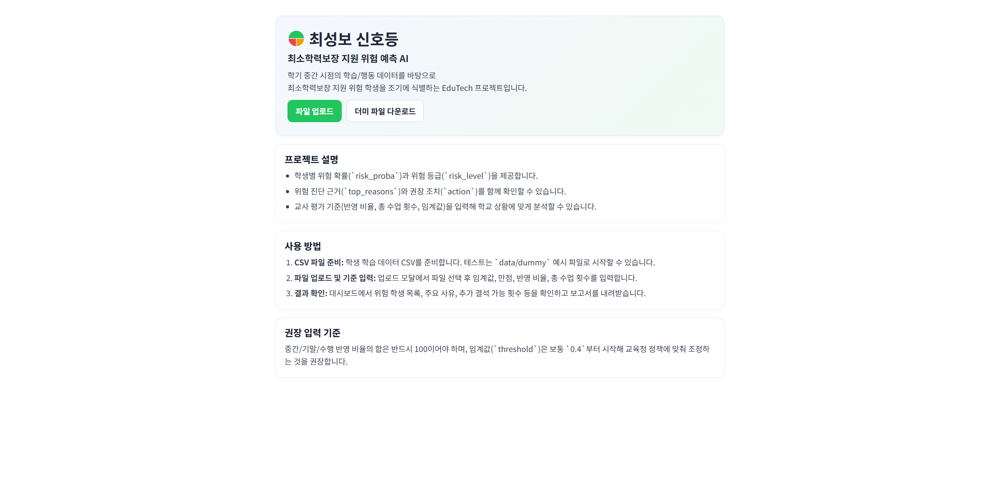
  </a>

  
랜딩 페이지 전체 캡처 보기 (PC / Mobile)

   

  <table>
    <tr>
      <th align="center">구성</th>
      <th align="center">PC</th>
      <th align="center">Mobile</th>
    </tr>
    <tr>
      <td align="center">메인 화면</td>
      <td align="center">
        
      </td>
      <td align="center">
        
      </td>
    </tr>
    <tr>
      <td align="center">업로드 상태</td>
      <td align="center">
        <a href="../preview/pc_landing_2_upload.png">
          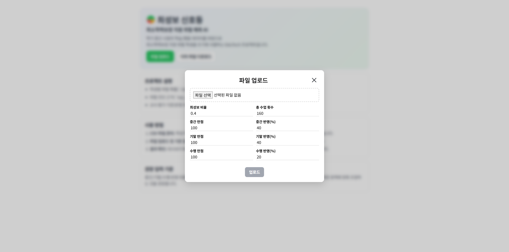
        </a>
      </td>
      <td align="center">
        <a href="../preview/mobile_landing_2_upload.png">
          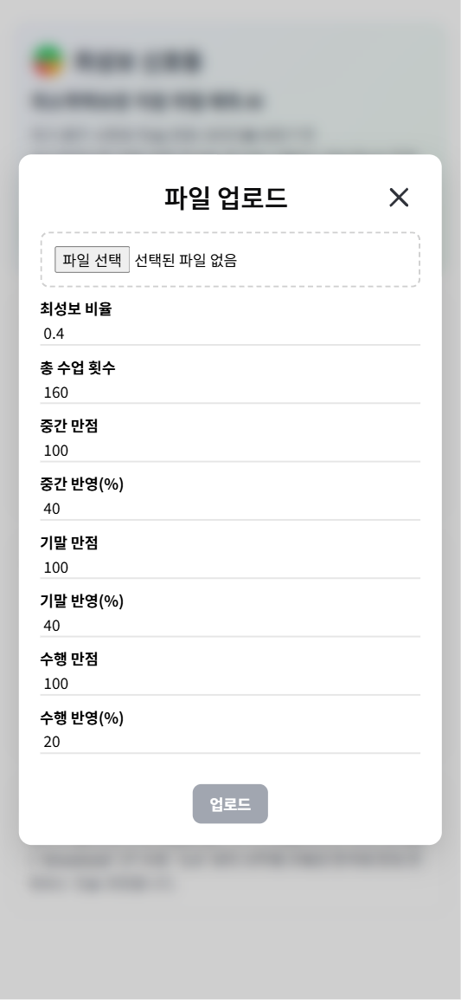
        </a>
      </td>
    </tr>
    <tr>
      <td align="center">업로드 오류</td>
      <td align="center">
        <a href="../preview/pc_landing_3_upload_error.png">
          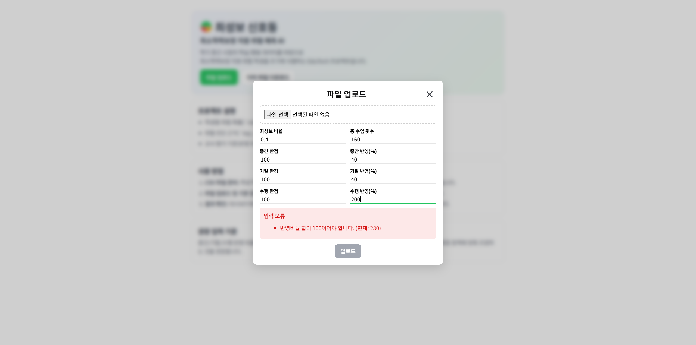
        </a>
      </td>
      <td align="center">
        <a href="../preview/mobile_landing_3_upload_error.png">
          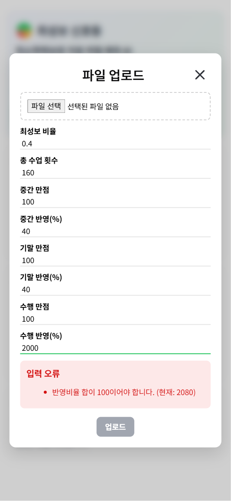
        </a>
      </td>
    </tr>
  </table>

## 2. 대시보드 (테이블 / 컬럼 선택 / 상세 드로어 / 필터)

### 대표 화면 (PC)

  <a href="../preview/pc_dashboard_1_main.png">
    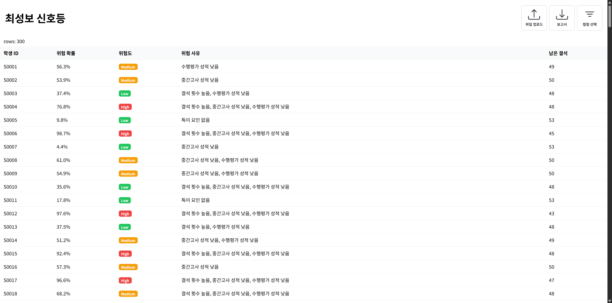
  </a>

  
대시보드 전체 캡처 보기 (PC / Mobile)

   

  <table>
    <tr>
      <th align="center">구성</th>
      <th align="center">PC</th>
      <th align="center">Mobile</th>
    </tr>
    <tr>
      <td align="center">메인 테이블</td>
      <td align="center">
        
      </td>
      <td align="center">
        <a href="../preview/mobile_dashboard_1_main.png">
          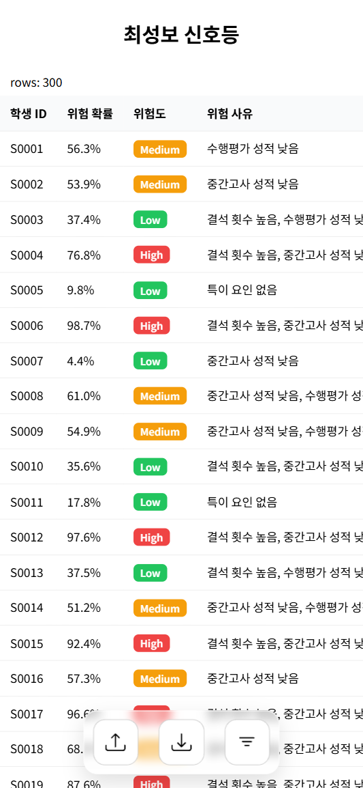
        </a>
      </td>
    </tr>
    <tr>
      <td align="center">컬럼 선택</td>
      <td align="center">
        <a href="../preview/pc_dashboard_2_columnSelector.png">
          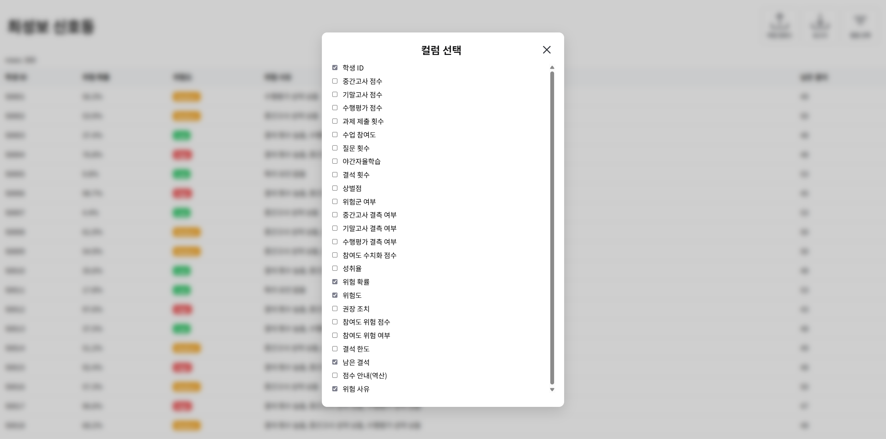
        </a>
      </td>
      <td align="center">
        <a href="../preview/mobile_dashboard_2_columnSelector.png">
          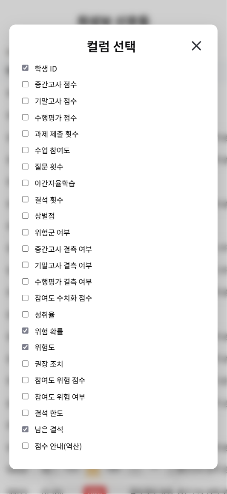
        </a>
      </td>
    </tr>
    <tr>
      <td align="center">상세 드로어</td>
      <td align="center">
        <a href="../preview/pc_dashboard_3_detailDrawer.png">
          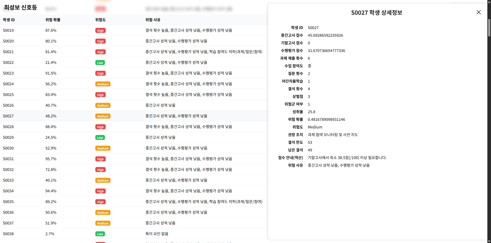
        </a>
      </td>
      <td align="center">
        <a href="../preview/mobile_dashboard_3_detailDrawer.png">
          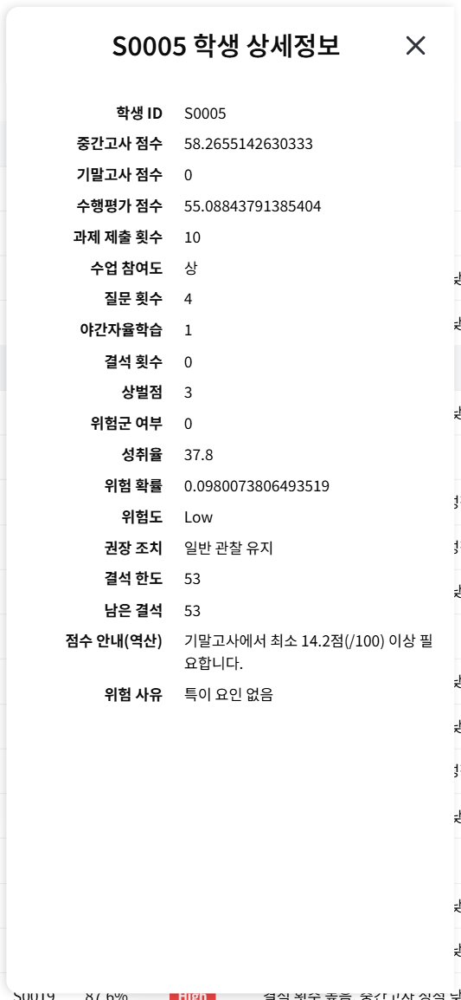
        </a>
      </td>
    </tr>
    <tr>
      <td align="center">필터 팝오버</td>
      <td align="center">
        <a href="../preview/pc_dashboard_4_filterPopover.png">
          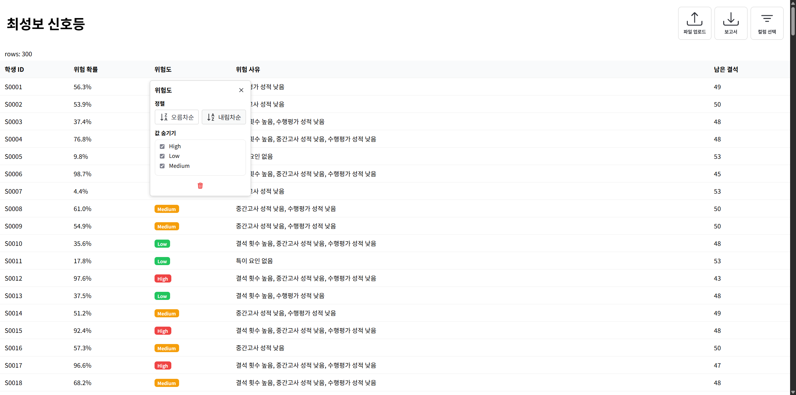
        </a>
      </td>
      <td align="center">
        
      </td>
    </tr>
  </table>

---

[`README로 돌아가기`](../README.md)

---
